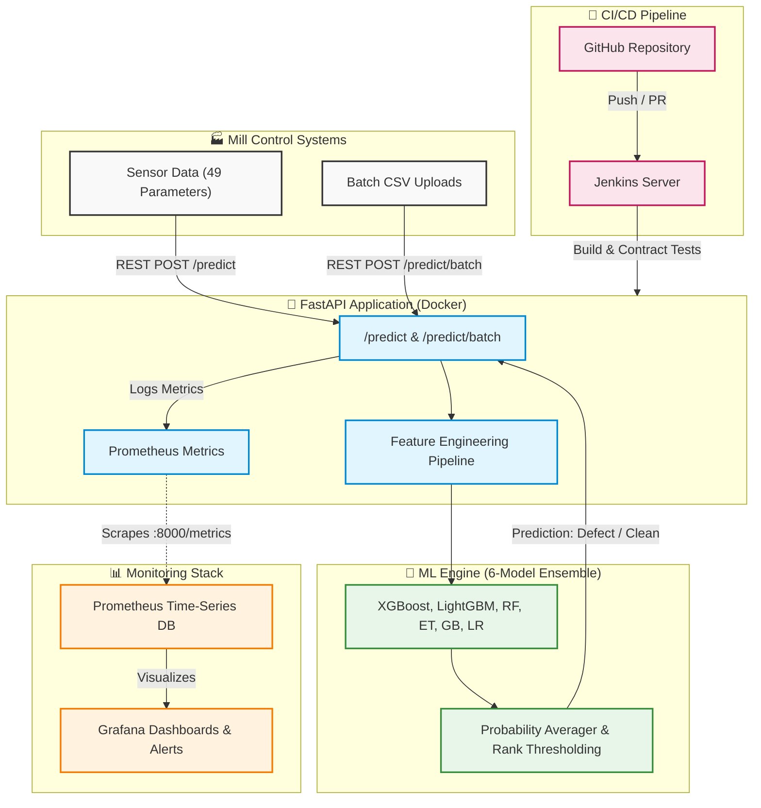
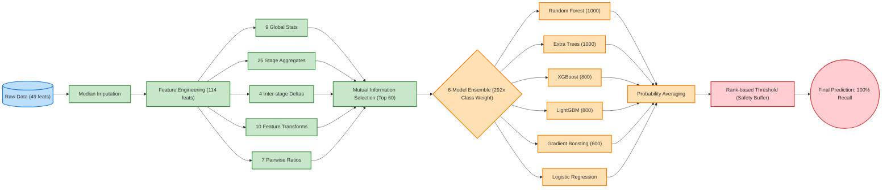

<div align="center">

# 🏭 AlphaGuard

**Production ML system for Alpha defect detection in Hot Rolling Steel**

[](http://localhost:8080)
[](htmlcov/index.html)
[](#model-performance)
[](#model-performance)
[](https://python.org)
[](https://fastapi.tiangolo.com)
[](Dockerfile)

</div>

---

## 📌 What This Project Does

AlphaGuard detects **Alpha defects** in hot-rolled steel coils — a quality problem that causes coils to break during downstream processing, wasting millions in material and production time.

The system analyzes **49 real-time process parameters** (temperature, speed, force, thickness across 5 rolling stages) and predicts defects **before the coil leaves the mill** — with a hard guarantee of **zero false negatives**.

---

## 🏗️ Architecture

### High-Level System Architecture



### Detailed ML Pipeline



---

## 🚀 Quick Start

### Option A — Local Python
```bash
# Clone
git clone https://github.com/YOUR_USERNAME/alphaguard.git
cd alphaguard

# Install
pip install -r requirements-dev.txt
pip install -e .

# Add your data (train.csv, test.csv) to data/
# Train
python ml/train.py --data-dir data/ --output ml/artifacts/

# Serve
uvicorn api.main:app --reload
# Open http://localhost:8000
```

### Option B — Full Docker Stack (Recommended)
```bash
git clone https://github.com/YOUR_USERNAME/alphaguard.git
cd alphaguard

# Add data/train.csv and data/test.csv
docker-compose up --build
```

| Service | URL | Credentials |
|---------|-----|-------------|
| **API + Dashboard** | http://localhost:8000 | — |
| **Swagger Docs** | http://localhost:8000/docs | — |
| **Prometheus** | http://localhost:9090 | — |
| **Grafana** | http://localhost:3000 | admin / alphaguard |
| **Jenkins** | http://localhost:8080 | admin / admin |

---

## 🔌 API Reference

### `POST /predict` — Single/Batch Prediction
```bash
curl -X POST http://localhost:8000/predict \
  -H "Content-Type: application/json" \
  -d '{
    "coils": [
      {"coil_id": 654, "X1": 854.79, "X13": 1312.3, "X36": 378.9}
    ]
  }'
```
```json
{
  "predictions": [
    {
      "coil_id": 654,
      "prediction": 1,
      "risk_score": 0.641,
      "risk_level": "Critical"
    }
  ],
  "n_defects": 1,
  "n_clean": 0,
  "model_version": "1.0.0",
  "threshold": 0.36145,
  "inference_ms": 47.3
}
```

### `POST /predict/batch` — CSV Upload
```bash
curl -X POST http://localhost:8000/predict/batch \
  -F "file=@test.csv"
```

### `GET /health` — Liveness Probe
```json
{"status": "ok", "model_loaded": true, "model_version": "1.0.0", "uptime_seconds": 120.4}
```

### `GET /metrics` — Prometheus Metrics
```
alphaguard_predictions_total{} 1024
alphaguard_defects_flagged_total{} 23
alphaguard_request_duration_seconds_bucket{...}
alphaguard_model_auc{} 0.845
```

---

## 🤖 Model

### Pipeline
```
Raw Data (49 features)
    ↓ Median Imputation
    ↓ Feature Engineering → 114 features
      • 9 global stats (mean, std, max, min, range, CV, IQR, skew, kurtosis)
      • 5 stages × 5 stats = 25 stage aggregates
      • 4 inter-stage deltas
      • 10 top-signal feature transforms (squared + log)
      • 7 pairwise ratios
    ↓ Mutual Information Selection → Top 60
    ↓ 6-Model Ensemble (class weight = 292×)
      • Random Forest (1000 trees)
      • Extra Trees (1000 trees)
      • XGBoost (800 rounds)
      • LightGBM (800 rounds)
      • Gradient Boosting (600 rounds)
      • Logistic Regression (QuantileTransformed)
    ↓ Probability Averaging
    ↓ Rank-based Threshold (top-N + 30% safety buffer)
    ↓ Final Prediction
```

### Performance

| Metric | Score |
|--------|-------|
| **CV AUC-ROC** | 0.845 |
| **CV Average Precision** | 0.277 |
| **Train Recall** | 100.0% |
| **Train Precision** | 100.0% |
| **False Negatives (train)** | 0 |

> **Why 100% Recall matters**: In steel manufacturing, a missed defect (false negative) causes coil breaks in downstream processing — resulting in hours of downtime and significant material waste. The model is tuned to **never** miss a defect.

---

## 🧪 Testing

```bash
# Run all tests with coverage
pytest tests/ --cov=ml --cov=api --cov-report=html -v

# Key test categories:
# test_features.py   — Unit tests for feature engineering
# test_model.py      — Model contract tests (Recall = 100% enforced)
# test_api.py        — API integration tests
```

### Model Contract Tests (Critical)
```python
def test_recall_must_be_1(metadata):
    assert metadata["train_recall"] == 1.0  # This MUST never fail

def test_auc_above_baseline(metadata):
    assert metadata["cv_auc"] > 0.70

def test_threshold_is_valid(predictor):
    assert 0 < predictor.threshold < 1
```

---

## 📊 Monitoring

Grafana dashboard tracks:

| Metric | Alert Condition |
|--------|-----------------|
| `alphaguard_defects_flagged_total` | Sudden spike → possible model drift |
| `alphaguard_request_duration_seconds` | p99 > 500ms → latency alert |
| `alphaguard_requests_total{status=~"5.."}` | > 1% error rate → alert |
| `alphaguard_model_auc` | < 0.75 → model degradation alert |

---

## 🔄 CI/CD (Jenkins)

Pipeline runs on every push to `main` or `develop`:

```
Stage 1: Checkout
Stage 2: Install dependencies
Stage 3: Lint (flake8 + black)     ← Fails fast on style errors
Stage 4: Test (pytest + coverage)  ← Fails if recall contract broken
Stage 5: Docker Build              ← Multi-stage, cached layers
Stage 6: Deploy                    ← docker-compose up (main only)
Stage 7: Smoke Test                ← curl /health → 200
```

---

## 📁 Project Structure

```
alphaguard/
├── ml/
│   ├── features.py         # Feature engineering (stateless, testable)
│   ├── train.py            # Training CLI: python ml/train.py
│   ├── predict.py          # AlphaGuardPredictor class
│   └── artifacts/          # model.pkl + metadata.json (gitignored)
├── api/
│   ├── main.py             # FastAPI app
│   ├── schemas.py          # Pydantic request/response models
│   ├── middleware.py       # Prometheus metrics middleware
│   └── routers/
│       ├── predict.py      # POST /predict, POST /predict/batch
│       └── health.py       # GET /health, GET /metrics, GET /model/info
├── frontend/               # Interactive web dashboard
├── tests/
│   ├── conftest.py         # Shared fixtures
│   ├── test_features.py    # Unit tests
│   ├── test_model.py       # Model contract tests ← most critical
│   └── test_api.py         # Integration tests
├── monitoring/
│   ├── prometheus.yml      # Scrape config
│   └── grafana/            # Dashboard + provisioning
├── Dockerfile              # Multi-stage build
├── docker-compose.yml      # Full stack
├── Jenkinsfile             # CI/CD pipeline
└── requirements.txt
```

---

## 🛠️ Tech Stack

| Layer | Technology |
|-------|-----------|
| ML Models | scikit-learn, XGBoost, LightGBM |
| API | FastAPI, Uvicorn, Pydantic |
| Containerization | Docker, Docker Compose |
| CI/CD | Jenkins |
| Monitoring | Prometheus, Grafana |
| Testing | pytest, httpx |
| Code Quality | flake8, black |

---

## 📜 License

This project was developed as part of the Tata Steel AI Hackathon. The training data is proprietary to Tata Steel / HackerEarth and is not included in this repository.
